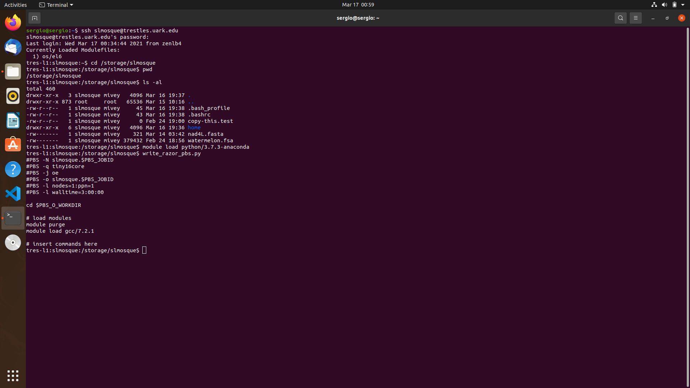

#### CV.md 
Curriculum Vitae Sergio Mosquera in markdown format.

#### assn03.tar.xz
PBS scripts and output files from nad4L.fasta blasted against different databases using the command line and AHPCC razor cluster. 

#### write-razor-pbs.py  
Python script model used in class for demonstration of how to write scripts and how to introduce variables.  

#### write_pinnacle_slurm.py   
Python slurm script model with variables. It has variables defined at the top of the script and they can be modified.  

#### write_razor_pbs.py  
Python pbs script model with variables. It has variables defined at the top of the script and they can be modified.  

#### commandline.png  
Image of command line showing execution of write_razor_pbs.py in trestles cluster. The execution of the script shows that $HOME/local/scripts directory in the AHPCC has been correctly added to my PATH.

#### Picture n1. Screenshot of scripts executed in /storage/slmosque directory from $HOME/local/scripts

#### nucleotide_composition.ipynb  
This is a Jupyter notebook used to calculate the number of DNA bases in the gene sequence nad4L (nad4L was assigned to dna_sequence variable), ATCG number of bases, and their frequency.  

#### nucleotide_composition.py  
Output file generated from the execution of script contained in nucleotide_composition.ipynb, gene nad4L was assigned to dna_sequence variable.  

#### nucleotide_composition1.py   
Python script (executable) for DNA sequence analysis generated from nucleotide_composition.ipynb. (In VS code you can transform from Jupyter notebook directly into Python script)    

#### parseGFF.py   
Python script (executable) from class to extract DNA sequences from a fasta file (genome) using the coordinates of specific genes from gff file (start and stop codon coordinates)

#### parse_GFF.py   
Python script (executable) to extract DNA sequences from a fasta file (genome) using the coordinates of specific genes from gff file (start and stop codon coordinates)    

#### parse_GFF1.py   
Python script (executable) to extract DNA sequences from a fasta file (genome) using the coordinates of specific genes from gff file (start and stop codon coordinates). Based on that a new function was added to reverse complement genes that were annotated in the (-) strand      

#### parse_GFFCDS.py   
Python script (executable) to extract DNA sequences from a fasta file (genome) using the coordinates of specific genes from gff file (start and stop codon coordinates) and it selects for exons present in the genome  

#### test.py   
Python script (executable) to create a function to reverse complement genes annotated in the (-) strand. (Work in progress)  

